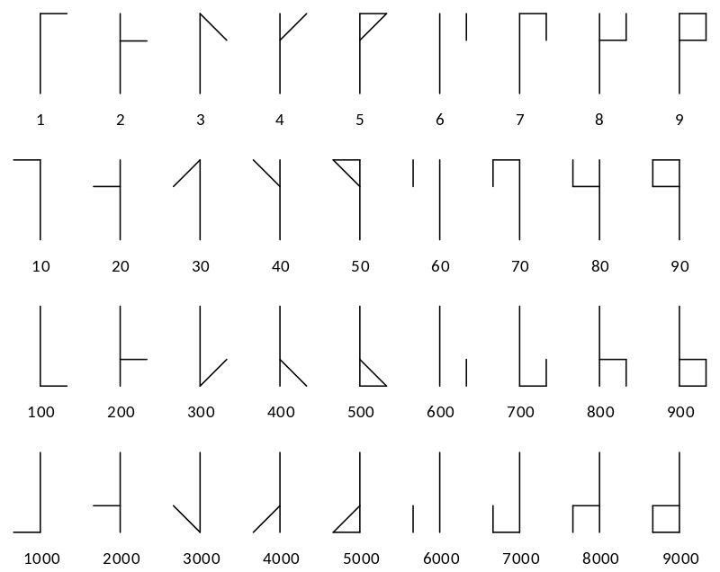

# Templed (Points: 10)
## The Ciphers of the Monks
**More Info:** [Here](http://www.davidaking.org/Ciphers.htm) or [Here](https://asecuritysite.com/challenges/monk)

**Cipher After Decryption:** 72 84 66 123 77 48 78 107 115 95 107 78 51 119 33 125
## Decimal to ASSCII
### Linux
Display ASSCII Table: ```man asscii```

Convert Decimal values to ASCII
### Go Online
Just Paste the Decimal Values on the Decimal Section [Here](https://www.rapidtables.com/convert/number/ascii-hex-bin-dec-converter.html)

**ASSCII Flag: HTB{M0Nks_kN3w!}**
